前几天我写了一篇关于解译 METAR 报文的文章： [*「优雅地解译机场 METAR 报文」*]()，其中提到 METAR 报文作为全球共享的公共数据，可以从多个渠道免费获得，那么今天我就来盘点几个公开提供 METAR 报文源的网络资源。

## 美国航空天气中心
主页网址：[https://aviationweather.gov](https://aviationweather.gov)

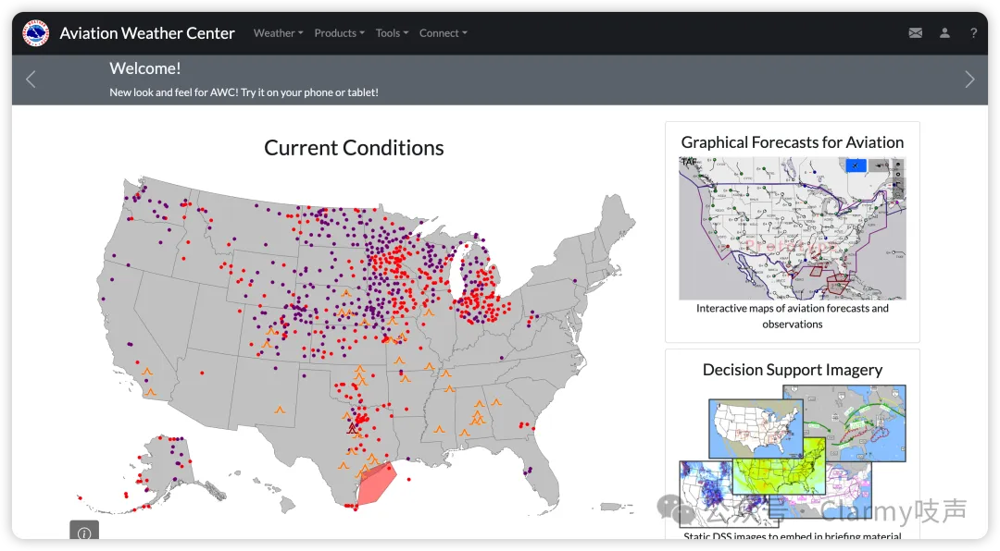

美国航空天气中心（Aviation Weather Center, AWC）是美国政府对外提供公开航空信息服务的网站，它隶属于美国国家天气服务（National Weather Service, NWS）。该网站提供相对全面的航空气象信息服务，且并不仅限于美国本土，它可以提供它收集来的全球大多数国家机场或航司公开共享的航空信息，包括但不限于终端观测、预报、飞行员报等丰富的数据产品。AWC 除了提供网页可视化的服务，也公开免费提供后端 API 接口服务，也就是说它是欢迎你用爬虫通过接口去他抓它的数据的。

后端 API 接口说明文档：[https://aviationweather.gov/data/api/#/](https://aviationweather.gov/data/api/#/)

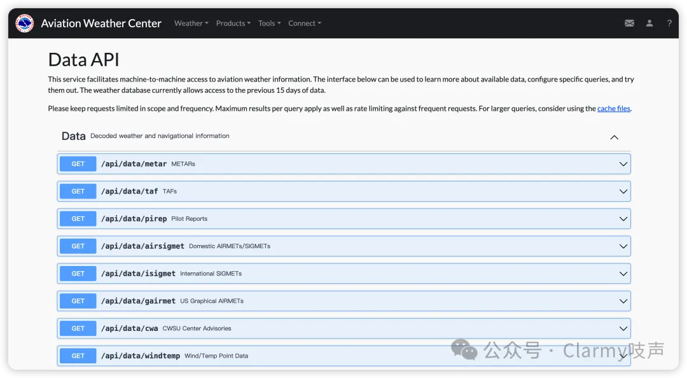

它的接口文档看样子使用的是 Swagger UI 框架实现的，既可以作为文档阅读，也可以现场测试，不要太方便。

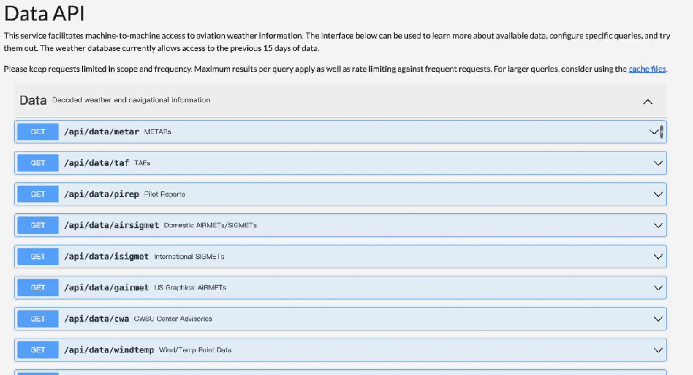

我们根据它的文档，用后端调用一下接口：

```python
import requests

URL = 'https://aviationweather.gov/api/data/metar?ids=ZBAA&format=raw&taf=false&hours=1'

resp = requests.get(URL)
resp.text.strip().split('\n')
```
返回的结果：
```
['ZBAA 020730Z 19003MPS 160V220 CAVOK M01/M15 Q1034 NOSIG',
 'ZBAA 020700Z VRB03MPS CAVOK M01/M15 Q1033 NOSIG']
```
是不是很简单，而且如果你把 `format=raw` 参数改成 `format=json`，它还可以自动帮你把报文解译成 json 格式的数据。

```
URL = 'https://aviationweather.gov/api/data/metar?ids=ZGGG&format=json&taf=false&hours=1'
```

返回结果（json 格式美化后）：

```json
[{"metar_id": 490844811,
  "icaoId": "ZGGG",
  "receiptTime": "2024-02-02 07:35:22",
  "obsTime": 1706859000,
  "reportTime": "2024-02-02 07:30:00",
  "temp": 29,
  "dewp": 18,
  "wdir": 170,
  "wspd": 12,
  "wgst": None,
  "visib": "6+",
  "altim": 1014,
  "slp": None,
  "qcField": 16,
  "wxString": None,
  "presTend": None,
  "maxT": None,
  "minT": None,
  "maxT24": None,
  "minT24": None,
  "precip": None,
  "pcp3hr": None,
  "pcp6hr": None,
  "pcp24hr": None,
  "snow": None,
  "vertVis": None,
  "metarType": "METAR",
  "rawOb": "ZGGG 020730Z 17006MPS 9999 SCT040 29/18 Q1014 NOSIG",
  "mostRecent": 1,
  "lat": 23.392,
  "lon": 113.307,
  "elev": 11,
  "prior": 3,
  "name": "Guangzhou/Baiyun Intl, GD, CN",
  "clouds": [{"cover": "SCT", "base": 4000}]}]
```

此外你也可以通过修改 URL 中的 `hours` 参数来指定要回溯查找过去多少个小时的数据，例如 `hours=5` 表示回溯查找到5个小时前的数据，最长支持约一个月（720个小时）的回溯。

其他数据和使用方法可以参考文档的内容做探索。

## 美国国家天气服务
主页地址：[https://www.weather.gov](https://www.weather.gov)

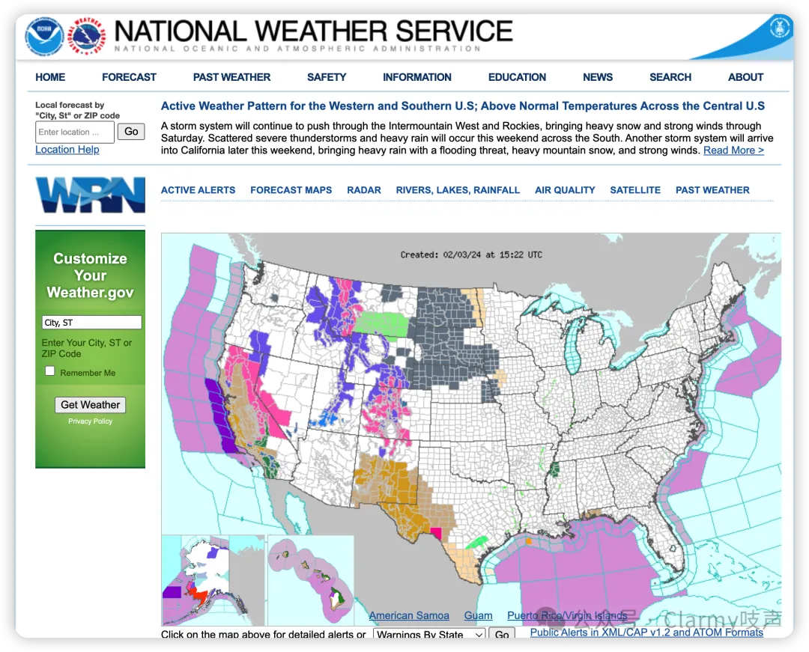

美国国家天气服务（National Weather Service, NWS）是美国政府的一个机构，隶属于美国商务部下的国家海洋和大气管理局（National Oceanic and Atmospheric Administration, NOAA）。

前面提到的 AWC 就是 NWS 的子机构，从航空 METAR 报文的角度来说，NWS 除了在 AWC 这个渠道公布数据以外，自己也会通过另一个渠道分享全量的气象数据（其中也包括 METAR 报告）：匿名 FTP。数据说明页面：[https://www.weather.gov/tg/engfiles](https://www.weather.gov/tg/engfiles)

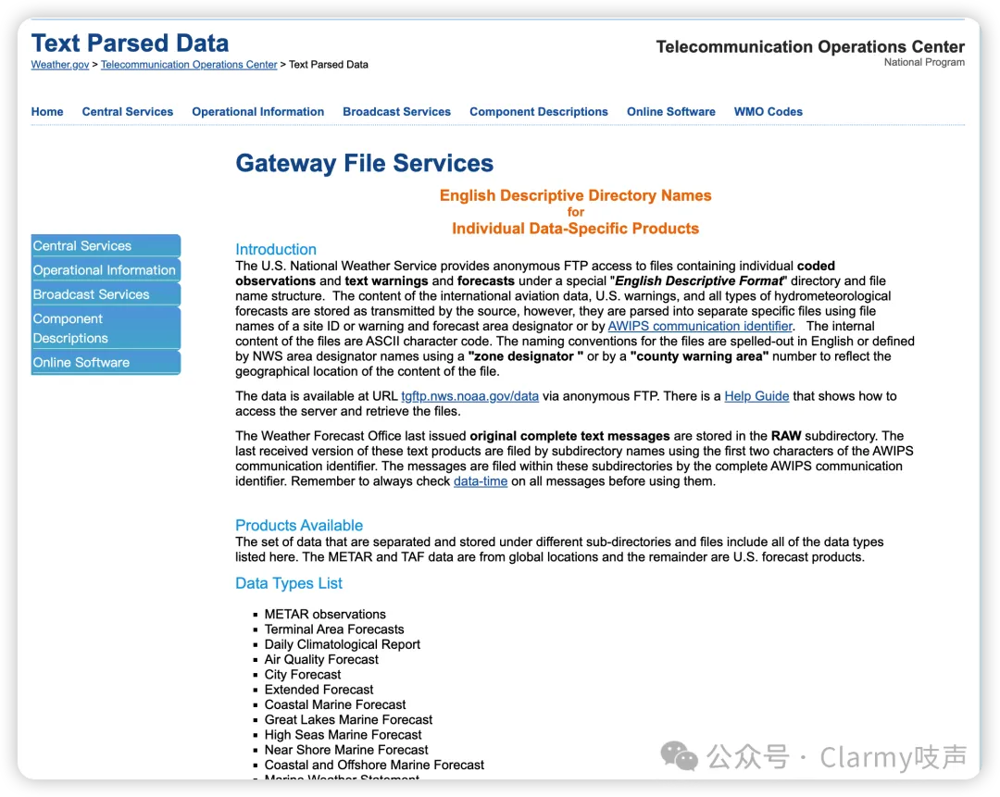

网站中关于匿名 FTP 的说明，翻译如下：

> 美国国家气象服务提供匿名FTP访问，以获取包含单个编码观测和文本警告以及预报的文件，这些文件存放在一个特别的“英文描述格式”目录和文件名结构下。国际航空数据、美国警告和所有类型的水文气象预报的内容按照源头传输的方式存储，但它们被解析成使用站点ID或警告和预报区域指示符的文件名，或者通过AWIPS通信标识符进行分离。文件的内部内容为ASCII字符代码。文件的命名约定用英语拼写或由NWS区域指示符名称定义，使用“区域指示符”或“县警告区域”编号来反映文件内容的地理位置。数据可通过匿名FTP在URL tgftp.nws.noaa.gov/data处获取。有一个帮助指南展示了如何访问服务器并检索文件。

也就是说，我们可以使用任何合适的 FTP 客户端（比如 Windows 的 XFTP、Mac 的 Finder），直接以 FTP 的协议访问 Host: tgftp.nws.noaa.gov/data 即可，用户名和密码留空即可访问。或者你也可以在浏览器里直接访问：[https://tgftp.nws.noaa.gov/data/](https://tgftp.nws.noaa.gov/data/) 以 HTTP 的方式访问 FTP 资源。

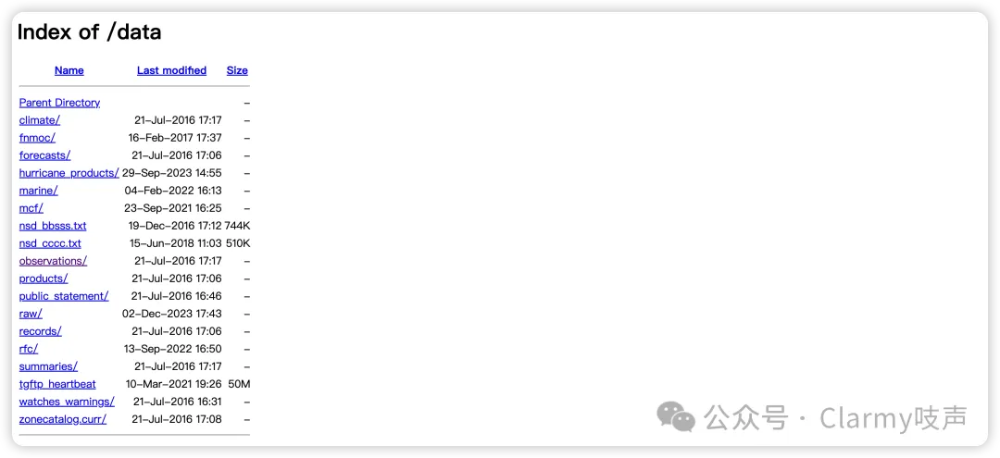

该 FTP 服务存储了他们所声称的所有公开的数据，对于我们想要的 METAR 报文数据，只需要按照 observations/ -> metar/ -> stations/ 的顺序依次点开目录即可。

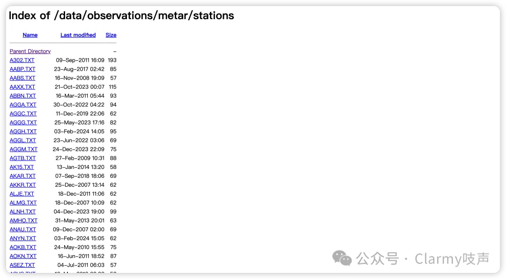

这里存储他们从全世界所能搜集到的所有的 METAR 原始报文，按照直观统计有 1.1w 个机场（实际上保持更新的比这个数量少，有很多机场的数据不再更新），我们点开昆明长水机场所对应的 ICAO 码: ZPPP.TXT ，可以看到长水机场的最新 METAR 报文（行文至此的当前时间为北京时间2024年2月2日16:25，即 UTC 时间2024年2月2日08:25）：

```
2024/02/02 08:00
ZPPP 020800Z 24008MPS 9999 SCT030 BKN043 14/01 Q1018 NOSIG
```

如果我们想要用后端程序抓取，也很简单，我们套用前面的那段代码，修改 URL 地址：

```python
import requests

URL = 'https://tgftp.nws.noaa.gov/data/observations/metar/stations/ZPPP.TXT'

resp = requests.get(URL)
datetimestr, metar = resp.text.strip().split('\n')
```

这就可以既得到原始 METAR 报文，也得到了准确的时间信息（METAR 报文不提供年和月的信息）。你只需要替换 URL 中的 ICAO 码（即 ZPPP）即可。但是要注意的是 NWS 只能提供大型国际机场的 METAR 报，提供不了国内非国际机场的的数据。但是 NWS 提供的数据稳定性是有保障的，而且对于爬虫的容忍度相对较高。

## 爱荷华州立大学
爱荷华州立大学提供了一个可以下载长周期历史回溯的 METAR 报文归档查询的服务。

网址：[https://mesonet.agron.iastate.edu/request/download.phtml?network=CN__ASOS](https://mesonet.agron.iastate.edu/request/download.phtml?network=CN__ASOS)

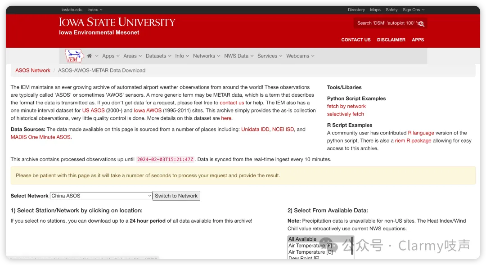

根据网站的自我介绍：

> IEM维护着一个不断增长的全球机场天气自动观测数据档案库！这些观测通常被称为“ASOS”或有时是“AWOS”传感器。一个更通用的术语可能是METAR数据，这是一个描述数据传输格式的术语。如果您在请求数据时没有获得数据，请随时联系我们寻求帮助。IEM还拥有美国ASOS（2000年至今）和艾奥瓦州AWOS（1995-2011年）站点的一分钟间隔数据集。这个档案仅提供历史观测数据的原始收集，几乎没有进行质量控制。有关这个数据集的更多详情在这里。
>
> 数据来源：此页面上提供的数据来自多个来源，包括：Unidata IDD、NCEI ISD和MADIS One Minute ASOS。

我们可以根据需要选择国家（Select Network）、机场代码、所查询的要素以及时间区间，然后点击 **Get Data** ，即可获得相应的所在区间的相应信息（如果存在）。

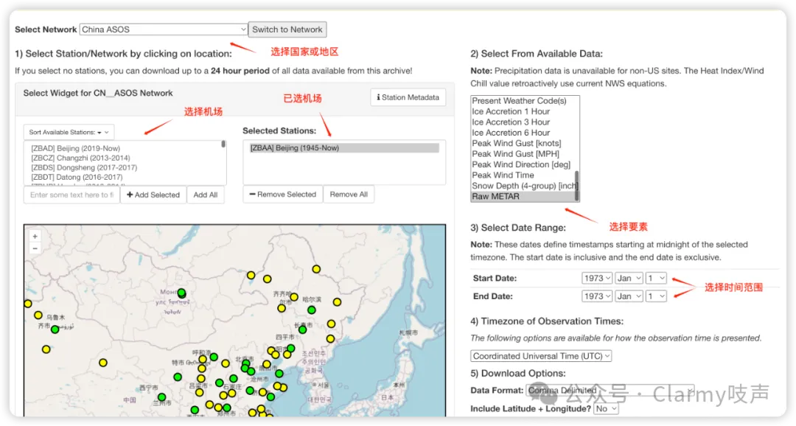

比如如果我查询北京首都机场的 METAR 报文，最远甚至可以查询到 1973 年。

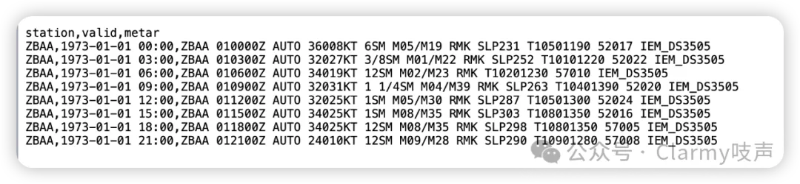

因此，如果你想做一些大型机场的历史气象研究又苦于拿不到长周期的历史观测数据，可以到这里来下载，且完全公开免费。

## ogimet.com
主页：[https://ogimet.com](https://ogimet.com)

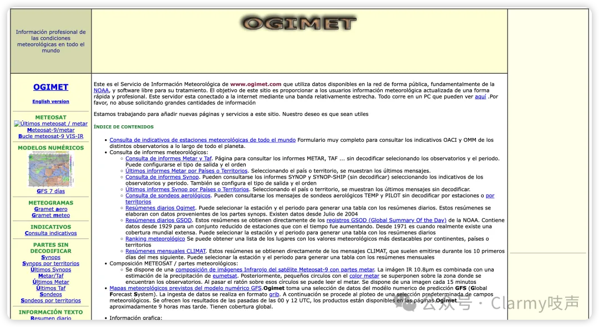

ogimet.com 是一个提供公共气象数据的简陋小网站，但是内部能够提供的气象数据相当的丰富，甚至 54511（WMO位于北京的国际交换站编号）的最新探空数据都可以在上面查到。原网站是西班牙语的，这里用 ChatGPT 翻译了一下它的自我介绍：

> 这是 www.ogimet.com 的气象信息服务，它使用在网络上公开可用的数据，主要来自 NOAA，以及开源软件来处理这些数据。这个网站的目标是以快速和专业的方式为用户提供最新的气象信息。这个服务器通过一条相对狭窄的带宽连接到互联网。所有内容都运行在您可以在这里看到的一台PC上。请不要滥用请求大量信息。
>
> 我们正在努力为这个网站添加新的页面和服务。我们的愿望是它们能够有所帮助。

当然网页自我介绍里说了不希望滥用请求，就说明该网站在稳定性上无法得到保证，很有可能随时被爬虫抓崩。但是我们仍然可以把它作为一个备用数据源，具体的查询页面是：[https://www.ogimet.com/umetars.phtml.en](https://www.ogimet.com/umetars.phtml.en)，以这个网址访问，页面就会按照英文显示了。

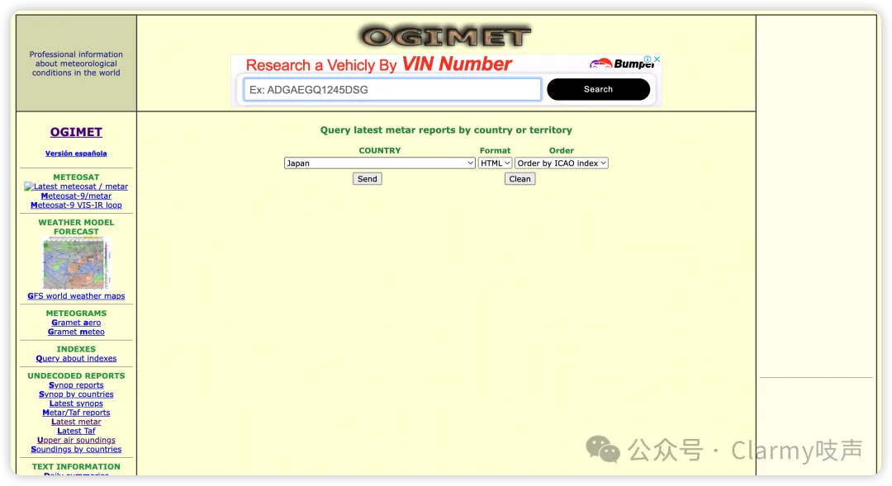

我们可以按照国家来选择要获取的 METAR 报文信息，它会返回该国家最新的 METAR 报文，例如我选 China，它会返回中国大陆地区的所有机场报文。

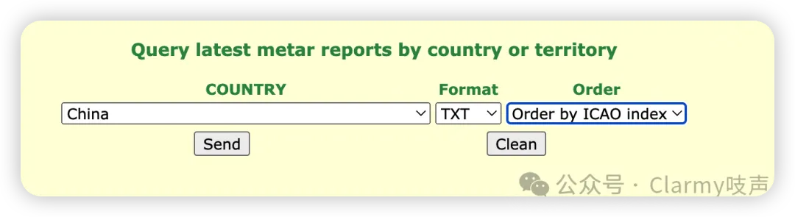
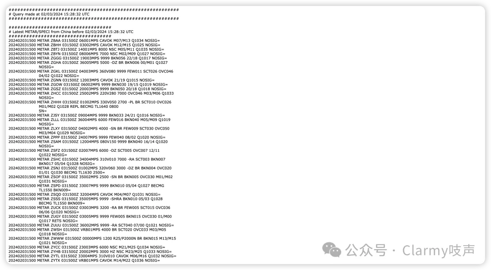

出于一种礼貌的保护，我就不在这里演示使用后端程序抓取了。

## skyvector.com
主页：[https://skyvector.com](https://skyvector.com)

skyvector.com 是一个提供了丰富可视化的航空服务网站，它的特点是提供了自己绘制的精美的全球航空瓦片地图，在底图中绘制了航空行业的很多更专业的信息。同时也提供全球机场的 METAR 报文数据。

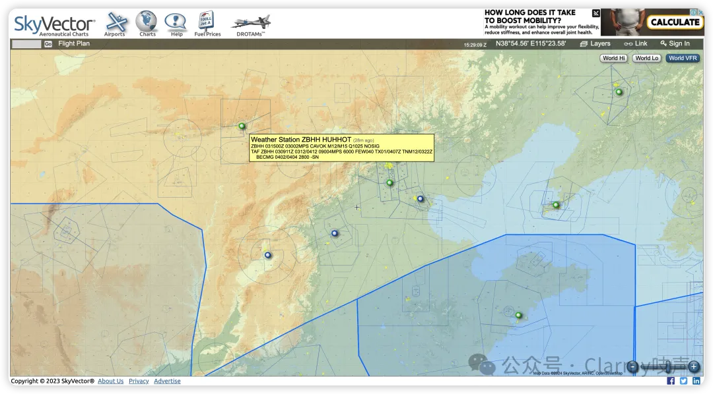

但是该网站的服务性能并不优秀，网页加载速度较慢。但是该网站的架构是前后端分离的，没有特别的反爬防御，可以通过抓包的方式高效抓取数据，但在这里不做演示。

## metar-taf.com
主页：[https://metar-taf.com](https://metar-taf.com)

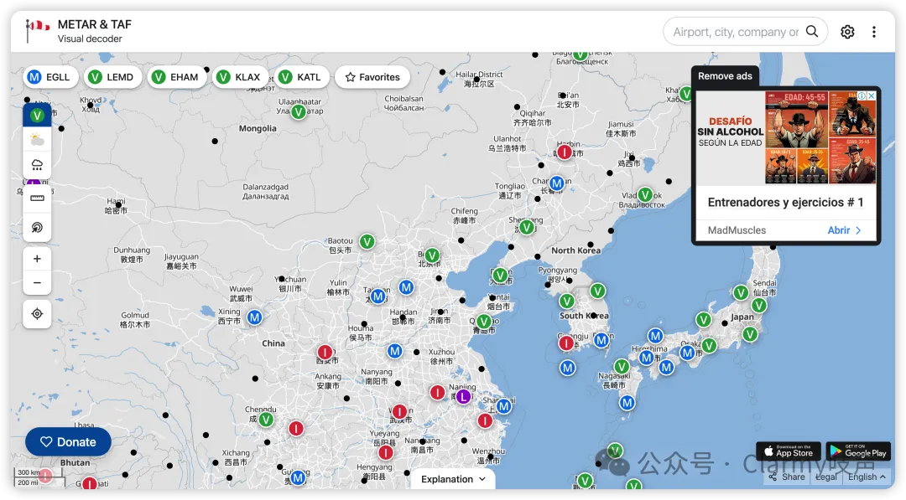

metar-taf.com 是一个商业化的机场气象信息网站，该网站的 UI 设计相当精美。它提供 METAR 报文信息，也提供相应的后端查询接口，但是因为它是一个商业化网站，所以通过后端抓取 METAR 数据是要购买额度的。该网站的反爬虫防御仅做了 User-Agent 识别，因此直接抓取的难度较低，然而它的数据也并不能覆盖中国地区的中小型机场。

这里给出一个后端抓取的简单示例：
```python
import re
import requests

def extract_metar(html):
    pattern = r"METAR\s[\w\s\/]+\d{6}Z\s[AUTO\s\dKT\s]+[\dSM\s]+[CLR\s]+[\w\s\/\d]+"

    metars = re.findall(pattern, html)
    return list(set(metars))
    
url = 'https://metar-taf.com/KBFF'
headers = {'User-Agent': 'Mozilla/5.0 (Macintosh; Intel Mac OS X 10_15_7) AppleWebKit/537.36 (KHTML, like Gecko) Chrome/121.0.0.0 Safari/537.36'}
resp = requests.get(url, headers=headers)
if resp.ok:
  print(extract_metar, resp.text)
```
结果：
```python
['METAR KBFF 031353Z AUTO 09004KT 6SM BR OVC005 04/03 A2959 RMK AO2 SLP025 T00390028']
```
